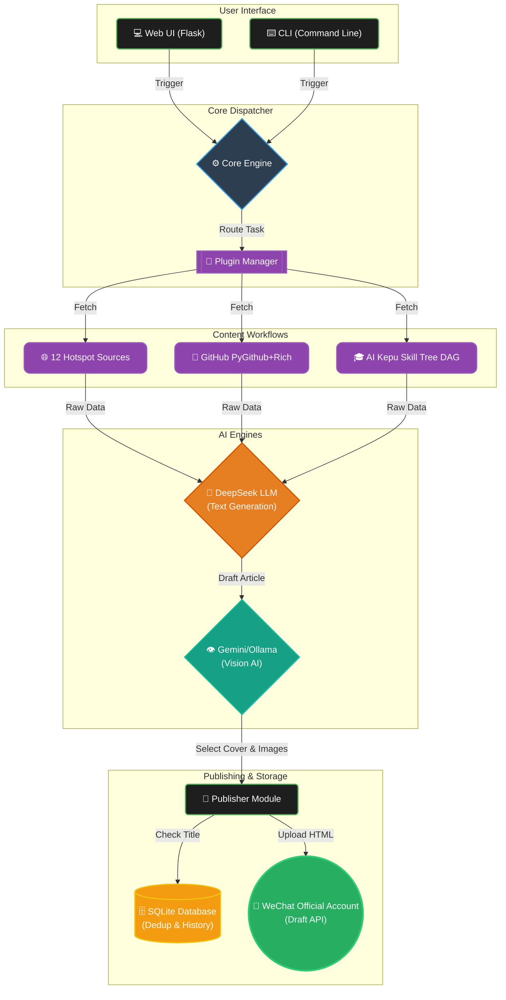
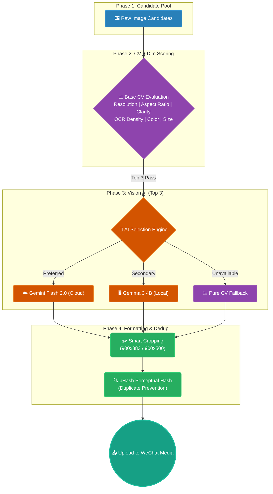

English | [中文](README.md)

# AutoWeChat: AI Content Factory

[](https://opensource.org/licenses/MIT)
[](https://www.python.org/downloads/)
[](https://api.deepseek.com)
[](https://ai.google.dev/)

Fully automated WeChat public account content production and publishing system. Integrates real-time hotspot monitoring, AI topic selection, deep article creation, intelligent image selection, and one-click publishing.

---

## 📋 Table of Contents

- [🏗️ Architecture Overview](#🏗️-architecture-overview)

- [✨ Features](#✨-features)
- [🛠️ Tech Stack](#🛠️-tech-stack)
- [📁 Project Structure](#📁-project-structure)
- [🚀 Quick Start](#🚀-quick-start)
- [💻 Web UI](#💻-web-ui-v30)
- [🖼️ Image Selection Strategy](#🖼️-image-selection-strategy)
- [⚙️ Core Configuration](#⚙️-core-configuration)
- [📚 Glossary](GLOSSARY_EN.md)
- [👨‍💻 Development Workflow](DEVELOPMENT.md)
- [Claude Code Guide](CLAUDE.md)
- [📋 Requirements](#📋-requirements)
- [📄 License](#📄-license)
- [⚠️ Disclaimer](#⚠️-disclaimer)

## 🏗️ Architecture Overview



---

## ✨ Features

**Multi-Source Hotspot Aggregation** — Parallel scraping from 12 platforms (Weibo, IT Home, 36Kr, Baidu, Zhihu, CSDN, RSS, Politics, Toutiao, The Paper, Huxiu, Douyin). Fully modularized via `PluginManager` with source-level health monitoring and automatic degradation.

**🎓 AI Kepu (Knowledge Popularization)** — Systematic educational article generation driven by a predefined DAG (Directed Acyclic Graph) Skill Tree:
- **Three-Phase Map-Reduce Prompt Self-Optimization** (🆕 v4.2): Specifically optimized for long-form educational articles (≥ 15,000 words). Outlining (Phase 1) → Prompt Self-Optimization (Phase 2, where LLM dynamically designs specific analogies, hooks, and forbidden overlaps for each section to prevent repetitive analogies across chapters) → Serial Generation & Context Passing (Phase 3, injecting the tail 500 words of the previous section to ensure smooth transitions).
- **Skill Tree Integration**: 30 knowledge nodes covering Math -> Deep Learning -> Transformer -> LLM -> Agents, with strict prerequisites.
- **Topological Selection**: Automatically selects hub nodes from unlocked prerequisites to ensure a step-by-step learning curve.
- **Educational Persona**: Uses analogies, visual thinking, and a WHY -> HOW -> WHAT structure.
- **Independent History Tracking**: Integrated with SQLite to record publication history and render them seamlessly inside the Web Console.

**AI Deep Creation** — DeepSeek-powered 2500-3500 word analysis articles.
- **Personalized Writer Personas (v4.1)**: Both hotspot and GitHub writers have full personality profiles — background, thinking patterns, expression principles, worldview. No more "AI-style" writing.
- **Tiered Bold Formatting**: Red bold (`**{{core conclusion}}`**, 3-5 per article) + black bold (key data/concepts, 1-2 per paragraph). Auto-fallback if LLM doesn't produce enough bold text.
- **API Truncation Detection**: Auto-detects if the LLM API silently truncated the article (incomplete ending). Retries automatically, preventing broken articles from being published.
- **Smart Retry**: When the first draft fails validation, passes it back to the LLM for targeted fixes (instead of rewriting from scratch), preserving good content.
- **Active Title Dedup (v4.0)**: 4 strategies (exact/fuzzy/keyword/AI semantic) to prevent duplicates, combined with Dual-end checks (local SQLite database + WeChat Cloud Draft Box sync).
- **Cloud Status Sync (v4.0)**: Auto-syncs local history with WeChat. Deleted cloud content releases local history.
- **Three-Tier Topic Selection**: AI+Politics (High) → Hardcore AI (Medium) → Finance+Politics (Low).
- **SQLite Database**: Migrated from JSON to a robust SQLite database for safe parallel writing and efficient querying.

**Intelligent Image Selection** — Multi-source image retrieval (Pollinations AI generation -> Pexels free stock -> Bing/Baidu crawling). 
- **LLM Keyword Optimization**: Uses LLM to transform abstract terms into visual search queries (e.g., "Regulation" -> "Tech Balance Scale") when standard searches fail.
- **Fixed Branding Cover**: GitHub articles use a standardized 2.35:1 branding cover for consistent visual identity.
- **Evaluation Engine**: 6-dimension scoring, perceptual hash dedup, and **Gemini Vision + Ollama local vision model** for AI-powered evaluation.

**Efficient Parallel Architecture**
- **GitHub images fully parallel**: 6 image sources run concurrently, stops when 3 collected (3-5x speedup)
- **Cover + article parallel**: Cover SD generation runs alongside article writing
- **Interruptible**: All long operations support user cancellation (Stop button responds in 0.5s)

**Safety & Compliance** — 4-strategy title dedup (exact/fuzzy/keyword/AI semantic). Cross-topic internal dedup. Draft box audit to prevent duplicates.

**Web Management UI** — Flask glassmorphism dark-theme dashboard:
- **Console**: One-click control (Start/Pause/Resume/Stop) and real-time streaming logs.
- **Image Studio** (🆕 v4.3): Extracts image placeholders from Markdown, generates configurable model Prompts (e.g. Imagen 3 / Midjourney v6 / FLUX.1), supports HTML5 drag-and-drop uploads, and provides high-fidelity mobile previews.
- **Diagram Engine** (🆕 v4.3): Supports 5 hybrid rendering engines including Mermaid, LaTeX cards, Graphviz, Tailwind HTML, and **Archify / D2 system architecture diagrams** with smooth fallback.
- **History Preview** (🆕 v4.2): Supports online and offline article previews. Click "Preview" next to any record to inspect draft style/content. Offline HTML cache files (saved under `data/previews/`) allow inspecting drafts even for failed tasks.
- **Sources Health** (🆕 v4.2): Features 12 source status cards. When the tab is active, polls the health API every 3 seconds to keep status in sync with workflow progress.
- **Settings**: Online configurations for API keys, models, **Image Gen Model** (`IMAGE_GEN_MODEL`), and **Diagram Parallel Workers** (`DIAGRAM_PARALLEL_WORKERS`).

**WeChat Integration** — Auto-push notifications to WeChat group bots after publishing.

---

## 🛠️ Tech Stack

- **Language**: Python 3.8+
- **LLM**: DeepSeek Chat / Reasoner
- **Vision AI**: Gemini Flash 2.0 (cloud) + Gemma 3 4B via Ollama (local)
- **Diagrams & Architecture**: Archify / D2 / Mermaid / Graphviz / LaTeX
- **GitHub**: PyGithub (API), rich (directory tree rendering), diagrams (architecture diagrams), carbon (code screenshots)
- **Crawling**: Requests, BeautifulSoup4, Selenium (Stealth Mode), icrawler
- **Image**: Pillow, numpy, Pollinations.ai API, Pexels API
- **Cache/Match**: requests-cache, RapidFuzz
- **Logging**: Loguru
- **Web**: Flask
- **API**: WeChat Official Account Draft API

---

## 📁 Project Structure

```
wechat_auto_publish/
├── main.py                    # CLI entry (supports --task hotspots/github)
├── webui.py                   # Flask Web management UI (v3.0)
├── config.py                  # Global configuration center
├── requirements.txt           # Dependencies
├── run.bat                    # CLI launch script
├── run_gui.bat                # Web UI launch script
├── data/                      # Database & runtime configuration directory
│   ├── auto_publish.sqlite    # SQLite database for title deduplication and history
│   ├── aikepu_skill_tree.json # AI science popularization skill tree configuration
│   ├── aikepu_history.json    # AI science popularization publish history (auto-generated)
│   └── hotspot_cache.sqlite   # Network hotspot request cache database (auto-generated)
├── core/
│   ├── engine.py              # Workflow dispatcher
│   ├── hotspots/
│   │   ├── collector.py       # 12-source hotspot engine
│   │   ├── processor.py       # AI article generation engine
│   │   └── workflow.py        # Hotspot publishing pipeline
│   ├── github/
│   │   ├── collector.py       # GitHub Trending (PyGithub + rich tree + diagrams + carbon)
│   │   ├── processor.py       # GitHub article generation (WeChat formatting)
│   │   └── workflow.py        # GitHub publishing pipeline
│   └── shared/
│       ├── llm.py             # DeepSeek API wrapper
│       ├── publisher.py       # WeChat API + title dedup
│       ├── article_utils.py   # Markdown->HTML + image embedding
│       └── runtime.py         # Log initialization
├── utils/
│   ├── image_handler.py       # Multi-source image retrieval + AI generation
│   ├── image_filter.py        # Image scoring / OCR / pHash dedup / Vision AI
│   ├── http_client.py         # HTTP session + cache + retry
│   └── spider.py              # Selenium browser launcher
├── static/                    # Web UI frontend assets
├── templates/                 # Web UI templates
└── assets/                    # Auto-downloaded image assets
```

---

## 🚀 Quick Start

### 1. Clone

```bash
git clone https://github.com/Chain813/wechat-automatic-publisher.git
cd wechat-automatic-publisher
```

### 2. Install Dependencies

```bash
python -m venv venv
venv\Scripts\activate
pip install -r requirements.txt
```

Or double-click `run.bat` for automatic setup.

### 3. Configure

Copy `.env.example` to `.env` and fill in:

```env
# Required
WECHAT_APP_ID="your-wechat-appid"
WECHAT_APP_SECRET="your-wechat-appsecret"
LLM_API_KEY="your-deepseek-api-key"

# Optional: LLM Model (default: deepseek-v4-pro)
LLM_MODEL="deepseek-v4-pro"

# Optional: GitHub API (for GitHub Trending articles, higher rate limit)
GITHUB_TOKEN="your-github-personal-access-token"

# Optional: Gemini Vision (cloud image evaluation)
GEMINI_API_KEY="your-gemini-api-key"

# Optional: WeChat group bot notification
QYWECHAT_WEBHOOK=""

# Optional: Ollama local vision model
OLLAMA_DEFAULT_MODEL="gemma4:e2b-it-q4_K_M"
OLLAMA_VISION_MODEL="gemma3:4b"

# Optional: Stable Diffusion (local image generation)
SD_ENABLED="True"
SD_API_URL="http://127.0.0.1:7860"

# Optional: Pexels free stock images
PEXELS_API_KEY=""
```

### 4. Run

**CLI mode:**
```bash
python main.py                    # Hotspot publishing (default)
python main.py --task github      # GitHub Trending publishing
```

**Web mode:**
```bash
python webui.py
```
Visit http://127.0.0.1:5000

---

## 💻 Web UI (v3.0)

The dark-themed dashboard provides:

| Page | Features |
|------|----------|
| **Console** | One-click start/stop, real-time log streaming, task type selection |
| **Image Studio** | **Drag-and-Drop Image Placement & Prompt Generator** (🆕 v4.3): Automatically parses image placeholders in Markdown, calls LLM to generate Imagen 3 English Prompts, supports HTML5 drag-and-drop image uploads and high-fidelity mobile WeChat draft previews. |
| **History** | Published articles grouped by date with offline/online draft preview |
| **Sources** | 12-source health status (green/yellow/red cards) with real-time polling |
| **Settings** | API key configuration with secret masking |

---

## 🖼️ Image Selection Strategy

### Hotspot Articles (AI-first)

1. **Pollinations.ai AI Generation** — Conceptual illustrations for current affairs (no stock photo matches specific events)
2. **Pexels Free Stock** — High-quality copyright-free images
3. **Bing Image Search** — Large landscape images filtered
4. **Baidu Image Search** — Domestic fallback
5. **Local Default** — Final fallback

### GitHub Articles & Deep Analysis (v4.0)

GitHub workflow has been upgraded to a **single-project deep-dive mode**. It automatically fetches and merges English/Chinese READMEs and reference docs, applying deep translation and polishing, and generates/retrieves at least 3 deep image assets:

| Priority | Source | Description |
|----------|--------|-------------|
| 1 | **README Screenshot** | **(NEW)** Headless Chrome screenshots the README rendering, automatically cropped to 2.35:1 WeChat aspect ratio. |
| 2 | **Live UI Screenshot** | **(NEW)** Headless Chrome screenshots the project's Homepage or Demo URL directly, bypassing local deployment issues. |
| 3 | **SD Art Illustration** | Local Stable Diffusion WebUI generates custom geek-style illustrations based on DeepSeek prompts. |
| 4 | **README Images** | Extracts existing illustrations/flowcharts directly from README files. |
| 5 | **Code Screenshot** | Carbon API renders main entry file code with high-quality styling. |
| 6 | **Directory Tree & Diagrams** | Renders file directory trees with rich, or system architecture diagrams via diagrams. |

Each image is evaluated on 6 dimensions, then optionally re-evaluated by vision AI:



---

## ⚙️ Core Configuration

Adjustable in `config.py` or `.env`:

| Config | Description | Default |
|--------|-------------|---------|
| `BRAND_NAME` | Brand name | AutoWeChat |
| `NEWS_SOURCES` | Enabled sources | 12 platforms |
| `FILTER_CATEGORIES` | Priority filter keywords | 79 terms |
| `LLM_MODEL` | LLM model | `deepseek-v4-pro` |
| `LLM_TIMEOUT` | LLM API timeout (seconds) | 180 |
| `LLM_TEMPERATURE` | Generation randomness | 0.75 |
| `IMAGE_DEFAULT_CANDIDATES` | Image candidates per search | 5 |
| `OLLAMA_VISION_MODEL` | Local vision model | gemma3:4b |
| `GITHUB_TOKEN` | GitHub API token (optional) | token-based |
| `SD_ENABLED` | Enable local Stable Diffusion | `True` |
| `SD_API_URL` | SD WebUI API address | `http://127.0.0.1:7860` |
| `DIAGRAM_PARALLEL_WORKERS` | Parallel diagram generation threads (Chrome + Graphviz) | 5 |

---

## 📚 Glossary

Detailed explanations of technical terms, tool names, and concepts used in this project: **[GLOSSARY_EN.md](GLOSSARY_EN.md)**

Covers: Technical Terms | Image Terms | GitHub Terms | WeChat Terms

---

## 👨‍💻 Development Docs

| Document | Description |
|----------|-------------|
| **[DEVELOPMENT.md](DEVELOPMENT.md)** | Development workflow: environment setup, coding standards, testing, release process, debugging tips, troubleshooting |
| **[CLAUDE.md](CLAUDE.md)** | Claude Code project guide: architecture overview, core modules, coding conventions, common development tasks |

---

## 📋 Requirements

- Python 3.8+
- [Graphviz](https://graphviz.org/download/) (for architecture diagram generation. On Windows, if installed at the default `C:\Program Files\Graphviz` path, the system will automatically inject it into the PATH environment variable without manual setup; otherwise, add it to system PATH manually)
- Chrome browser (for Selenium fallback scraping)
- Optional: [Ollama](https://ollama.com) for local vision AI
- Optional: [Stable Diffusion](https://github.com/AUTOMATIC1111/stable-diffusion-webui) (WebUI with `--api` enabled)
- Optional: EasyOCR for text detection (requires PyTorch ~2GB)

---

## 📄 License

[MIT License](LICENSE)

---

## ⚠️ Disclaimer

This tool is for technical research and content creation assistance only. Please comply with WeChat official account operating guidelines and relevant laws. AI-generated content should be reviewed by a human before publishing.
